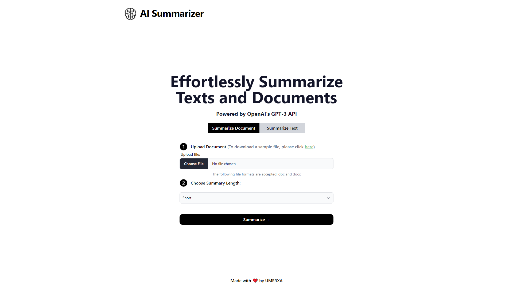

# AI Summarizer

This project summarizes any text and document for you using AI.



## How it works

This project uses OpenAI's advanced AI technologies, including the GPT-3 API to summarize any text or document.

## Running Locally

After cloning the repo, go to [OpenAI](https://beta.openai.com/account/api-keys) to make an account and put your API key in a file called `.env`.

Then, run the application in the command line and it will be available at `http://localhost:3000`.

```bash
npm run dev
```

## One-Click Deploy

Deploy the example using [Vercel](https://vercel.com?utm_source=github&utm_medium=readme&utm_campaign=vercel-examples):

[](https://vercel.com/new/clone?repository-url=https://github.com/umerarif01/ai-summarizer&env=OPENAI_API_KEY&project-name=ai-summarizer&repo-name=ai-summarizer)
